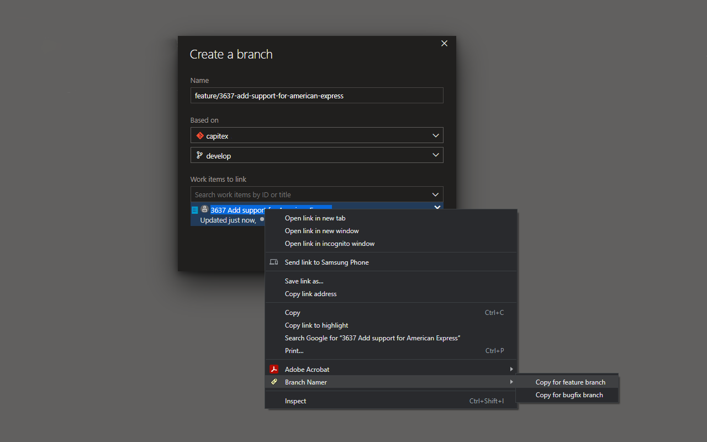

# Branch Namer
Branch Namer is a simple Google Chrome extension for naming Git branches in Azure DevOps. From the Chrome context menu, it lets you copy a text, typically containing an _ID_ and a _Title_ for a PBI or Bug in Azure DevOps, and convert it into a suitable Git branch name which can be pasted into the Azure DevOps _Name_ field for a new branch.

## Installation
For development, it can be installed as an extension in Chrome through _Manage extensions_, when _Developer mode_ is enabled, by using _Load unpacked_ and just selecting this source directory.
For normal use, it is better to download and install the latest released version directly from the Chrome Web Store where it should be available soon.

## Usage
Simply select a text in Chrome, typically containing the ID and Title for your PBI or Bug, and right click to open the context menu with _Branch Namer_ where _Copy for feature branch_ and _Copy for bugfix branch_ are available. The copied and reformatted text can be pasted into the Azure DevOps Name field for a new branch.

## Contributing
Pull requests are welcome. For major changes, please open an issue first to discuss what you would like to change.
Please make sure to update tests as appropriate.

## License
[MIT](https://choosealicense.com/licenses/mit/)
